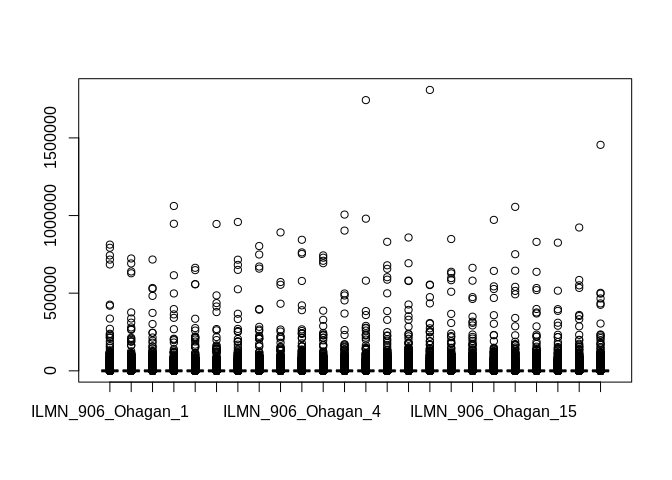
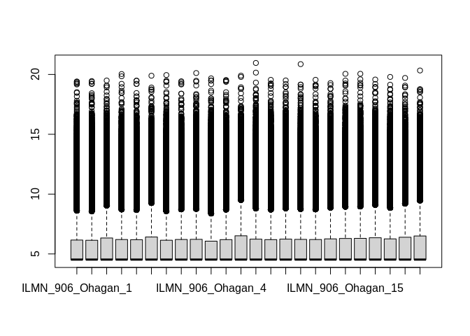
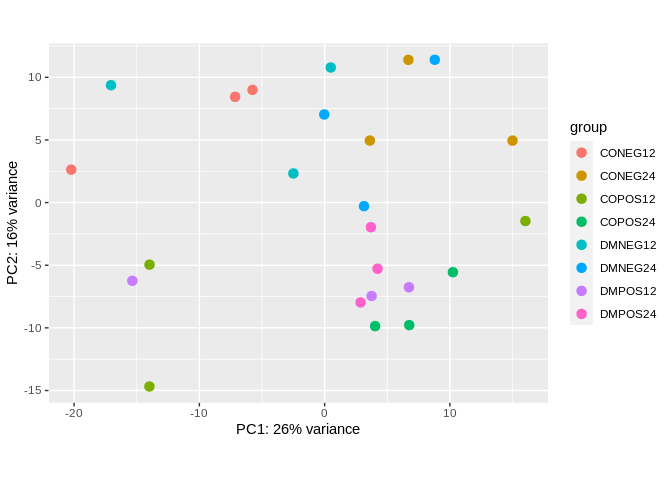
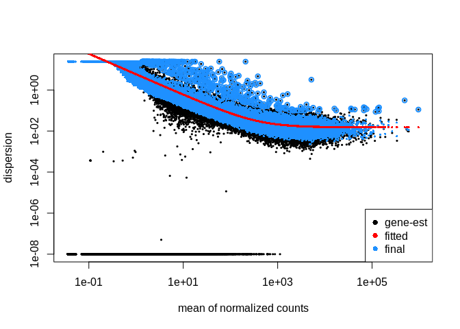
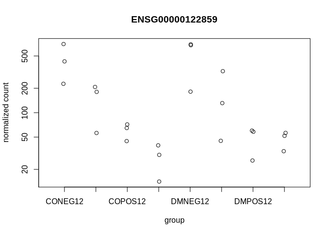

RNA-seq Visualization
================
Sam Miller

This is an R markdown document detailing the analysis of RNAseq data for
Miller et al., 2021

Load libraries

``` r
library(readr)
library(dplyr)
library(magrittr)
library(tximport)
library(DESeq2)
library(ggplot2)
library(apeglm)
```

## tximport

Read in sample sheet and gene map

``` r
sample_table <- read_tsv("rnaseq_samples.txt")
gene_map <- read_tsv("gene_map.tsv")
```

Direct tximport to proper files Extract the file names from our sample
sheet, and append /quant.sf in a vector

``` r
sample_files <- paste0(pull(sample_table, `file`))
sample_files <- paste0('quants/', sample_files, '/quant.sf')
```

Name the elements of the vector with the “file” names The vector
elements names will also become column names in the tximport output

``` r
names(sample_files) <- pull(sample_table, `file`)
```

tx2gene - summarizes multiple transcript expression values to a single
gene value Convert pseudocounts to counts using tximport

``` r
count_data <- tximport(files = sample_files,
                type = "salmon",
                tx2gene = gene_map,
                ignoreTxVersion = TRUE)
```

Matching count\_data order to sample\_table

``` r
all(rownames(sample_files) %in% colnames(count_data$counts))
```

    ## [1] TRUE

``` r
rownames(sample_table) <- pull(sample_table, `file`)

all(rownames(sample_files) == colnames(count_data$counts))
```

    ## [1] TRUE

Need to convert tibbles to dataframes for DESeq2 Need to remove all
spaces if present in columns headers or rows

``` r
sample_table <- as.data.frame(sample_table)
sample_table$abv <- as.factor(sample_table$abv)
sample_table$batch <- as.factor(sample_table$batch)
```

Design = is the expression of a gene dependent on the design of my exp

``` r
dds <- DESeqDataSetFromTximport(txi = count_data,
                    colData = sample_table,
                    design = ~ batch+abv)   
```

## PCA

PCA is a parametric technique that assumes normality. Log transformed
RNA-seq data is approximately normally distributed, so PCA is compatible
with log transformed counts. 0’s cause issues with log transormation, and
RNAseq data is heterostochastic (i.e. variance is unequal accross data), so
Variance stabilizaing transformation and regularized log transformation
can both be used to address this.

``` r
vst <- varianceStabilizingTransformation(dds)
```

To visualize counts prior to normalization

``` r
boxplot(counts(dds, normalized=FALSE))
```

<!-- -->

To visualize normalized counts

``` r
boxplot(assay(vst))
```

<!-- -->

Make PCA plot (can be modified using ggplot2 functions)

``` r
plotPCA(vst, intgroup='abv')
```

<!-- -->

## Hierarchical clustering

Get distance matrix for vst

``` r
d = assay(vst)
```

Transorm it

``` r
d = t(d)
```

Calculate distance matrix

``` r
d = dist(d)
```

Plot clusters

``` r
h = hclust(d)
```

## DESeq2

3 Steps to DESeq2 analysis

1.  estimate size factors (normalization)

``` r
dds <- estimateSizeFactors(dds)
```

To view factors, normalizationFactors(deseq\_dataset) View normalized
counts, `counts(dds, normalized=TRUE)[1:6, 1:3]` View unnormalized
counts, `count_data$counts[1:6, 1:3]`

1.  estimate dispersions

For low expression genes technical variance dominates For high
expression genes biological variance dominates Variance needs to be
estimated Know 3 reps isnt sufficient to get true mean Uses the variance
across whole experiment (observations for each sample for each gene)
Empirical bayesian shrinkage - uses measurements for one gene and
compares it to measurements of all the other genes and borrows
information about the variance of the other genes to shrink the
estimated variance for the gene currently being considered

``` r
dds <- estimateDispersions(dds)
```

Quality control plot Expect to see that as mean norm count increases,
that variance decreases Circled blue points are considered as outliers

``` r
plotDispEsts(dds)
```

<!-- -->

1.  Apply statistics (Wald Test) Statistic applied against a negative
    binomial distribution

``` r
dds <- nbinomWaldTest(dds)
```

All three steps can be short-cutted by dds &lt;- DESeq(dds)

Show comparisons made

``` r
resultsNames(dds)
```

    ##  [1] "Intercept"              "batch_2_vs_1"           "batch_3_vs_1"          
    ##  [4] "batch_4_vs_1"           "batch_5_vs_1"           "batch_6_vs_1"          
    ##  [7] "abv_CONEG24_vs_CONEG12" "abv_COPOS12_vs_CONEG12" "abv_COPOS24_vs_CONEG12"
    ## [10] "abv_DMNEG12_vs_CONEG12" "abv_DMNEG24_vs_CONEG12" "abv_DMPOS12_vs_CONEG12"
    ## [13] "abv_DMPOS24_vs_CONEG12"

Snap shot of results from comparison made

``` r
result_table <- results(dds)
summary(result_table)
```

    ## 
    ## out of 40554 with nonzero total read count
    ## adjusted p-value < 0.1
    ## LFC > 0 (up)       : 357, 0.88%
    ## LFC < 0 (down)     : 204, 0.5%
    ## outliers [1]       : 0, 0%
    ## low counts [2]     : 26050, 64%
    ## (mean count < 47)
    ## [1] see 'cooksCutoff' argument of ?results
    ## [2] see 'independentFiltering' argument of ?results

To quickly visualize counts for an individual gene

``` r
plotCounts(dds, gene="ENSG00000122859", intgroup="abv")
```

<!-- -->
